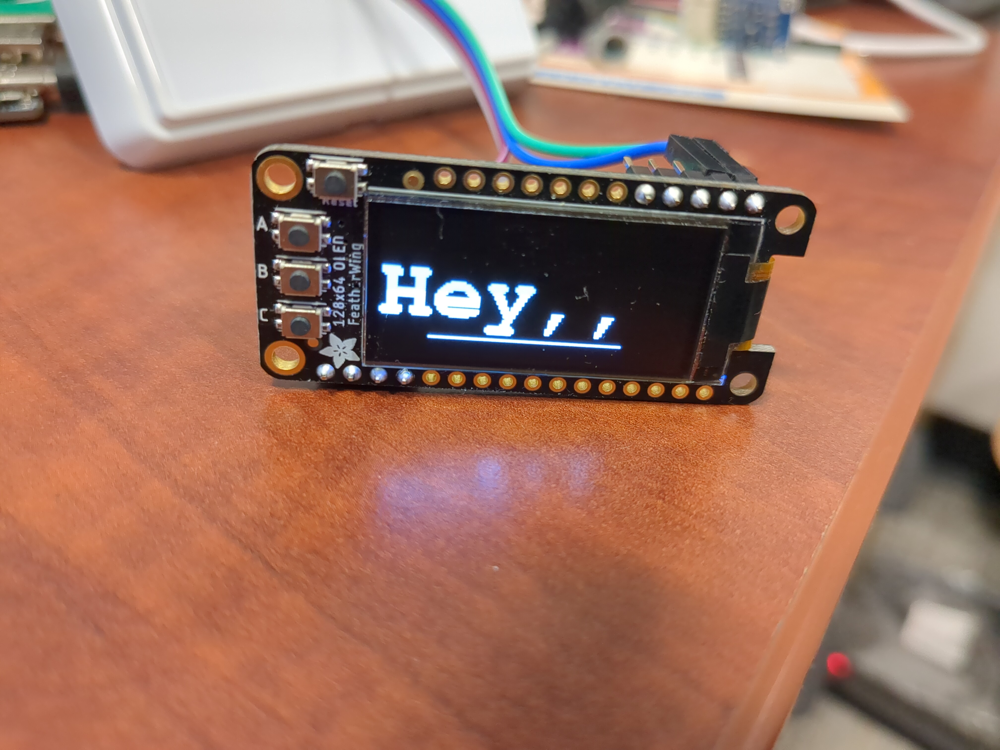

# viam-i2c-display
A Viam module for driving some models of displays

This has been developed and tested on this display specifically: https://www.adafruit.com/product/4650
It may work on other displays. At some point in the future I'll add support for other displays, including some e-ink displays.

This allows you to write lines or text to the display. Text will be written in the FreeMono Bold 18pt font. Lines will be written one pixel wide.

Also enabled is the ability to write any arbitrary data you like as a byte array.

## (In)stability notice

This module implements its own API. I might change the API if I update this to do something else, but I'll try not to break it.

## Setup

Add the module to your robot from the Viam registry. The component may then be added to your configuration as follows

```
  ...
  "components": [
    ...,
    {
      "name": "yourNameHere",
      "model": "biotinker:component:display",
      "type": "display",
      "namespace": "biotinker",
      "attributes": {
        "i2c_bus": "i2c bus number here. 1 on a Pi for example"
      }
    },
    ...,
  ],
  ...
```

## Usage

This provides the following API:

### DrawLine(x0, y0, x1, y1)

Uses Bresenham's algorithm to draw the specified line. (0,0) is the bottom left corner. (+x, +y) is up and right. Supports negative numbers and wrapping.

### WriteString(x, y, text)

Will write the given text starting at the given location. (0,0) will start on the left side of the screen, near the bottom. Will wrap, but will not linebreak for you.

### DisplayBytes(bytes)

Writes the given bytes directly to the screen. If too many are given, then will write the first 1024. If too few are give, the remainder will be blank.

### Reset()

Clears the display and reinitializes.

### Example usage

You will want to import `"github.com/biotinker/viam-i2c-display/display/api/displayapi"`

```
	disp, err := displayapi.FromRobot(robot, "disp")
	fmt.Println("err", err)
	disp.Reset(context.Background())
	disp.WriteString(context.Background(), 0, 20, "Hey,,")
	disp.DrawLine(context.Background(), 20, 10, 100, 10)
```

This will produce the following:


